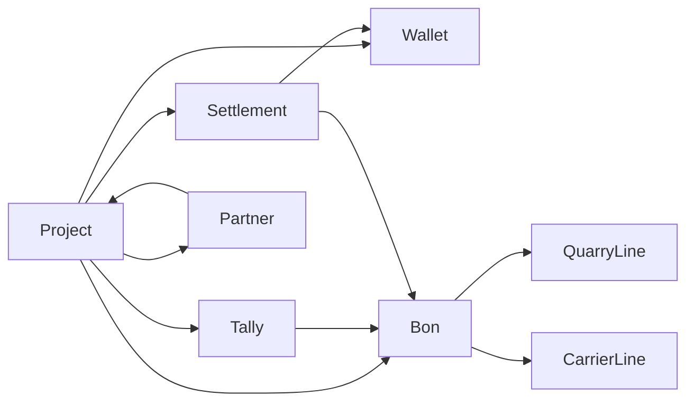

# Implementation phases

Locked rules: [brd-locked-decisions.md](brd-locked-decisions.md). Client sign-off: [client-delivery-brief.ar.md](client-delivery-brief.ar.md).

Stack: Tailgrids + [design.md](../design.md). TanStack Table for large grids. No shadcn. Simple-code rule always on.

Phases are capability stages, not calendar promises. **MVP = end of Phase 4.**

```mermaid
flowchart LR
  P0[Phase0_Lock] --> P1[Phase1_Foundation_ar_rtl]
  P1 --> P2[Phase2_Bons]
  P2 --> P3[Phase3_Settlements]
  P3 --> P4[Phase4_Treasury_PartnerRO]
  P4 --> MVP[MVP]
  MVP --> P5[Phase5_Equipment]
  P5 --> P6[Phase6_Reports]
  P6 --> P7[Phase7_Profit]
  P7 --> P8[Phase8_GoLive]
```

## Phase 0 — Lock and strip

- Decision pack closed; client briefs issued.
- Keep Tailgrids shell; remove leftover storefront chrome if any.
- Agent reference: `docs/brd-locked-decisions.md`.

## Phase 1 — Foundation (Arabic primary)

- Default `lang="ar"`, `dir="rtl"`.
- React Aria `I18nProvider` locale `ar` by default; `en` switches to LTR.
- Arabic font primary; Latin stack for English mode.
- Auth + five roles with per-project grants (Accounts Manager may be global).
- Master data: Project (`contract_value`, trade name, logo, currencies), Client (one per project), Supplier, Material, Truck directory, Rate card, Equipment (per-project charging method).
- Open-ended currencies; LYD functional.
- Home: list of the user’s projects only.
- Smoke-test Tailgrids controls in Arabic RTL first, then English LTR.
- Numbers: Western digits for accounting clarity.

## Phase 2 — Bons and tally

- Internal / external supply bons; paper serial + internal sequence; m³ deductions.
- External bon: two prices → two payables (quarry material + carrier haulage).
- Tally sheets; report-vs-tally: bon trips cannot exceed signed tally without reason; under-tally alert for missing bons.
- Bulk entry: Tailgrids + TanStack Table. One photo per bon; required for external.
- Status: Pending → In Settlement → Paid; amend/cancel per locked decision #6.

## Phase 3 — Settlements

- Settlement = bons − advances − credit expenses − rare delay penalty.
- Full and partial pay (user-selected bons; advances oldest-first).
- Atomic payment: bon statuses, clear advances, wallet debit, auto journal.
- Statements scoped `(party × project × currency)`.

## Phase 4 — Treasury + partner read-only (**MVP gate**)

- Multi-currency wallets; custody `(person × project × currency)`; transfers; FX per decision #3.
- Negative wallet: warn + Managing Partner confirm.
- Wallet reconciliation equation (BRD §8.6).
- Optional opening balances on the go-live project.
- Partner read-only: cost by item, wallets, capital, loans, management %.
- **MVP complete here.**

## Phase 5 — Equipment and expenses

- Four charging modes; monthly formula with `26 × hours-per-day`; linear cost.
- Equipment advances; closeout; lessor settlement same path as suppliers.
- Expenses (no bon): subsistence via attendance, gratuities, transfer commission as expense, diesel, payroll as monthly total.
- Owned charge-out posts 5100/4900; management profit excludes 4900.

## Phase 6 — Accounting and reports

- Chart of accounts from BRD §18 (omit 2400 postings in v1).
- Auto journals for built flows; audit log on every financial operation.
- Cost statement (cumulative + period); supply; equipment; expenses; FX difference; debt/aging on `contract_value`.

## Phase 7 — Profitability, partners, closeout

- Collections → revenue on cash; retention reserve from `contract_value`.
- Partner distribution, management %, loan recovery, surplus withdrawals (decision #9).
- Closeout checklist and lock.
- Full partner portal beyond MVP read-only.

## Phase 8 — Go-live

- Seed one new project + opening balances; train; parallel-run vs Excel; launch.
- Live Excel projects stay until a later migration phase.

## Out of v1

BOQ, budget, PO/warehouse, depreciation, subcontractor retention, offline, tax journals, waste module, Technical Office role, inter-project transfers, consolidated company P&L.

## Domain spine

Core entities: Project, Wallet `(project × cash|bank × currency)`, Bon (two payable lines for external), Tally, Settlement, Supplier (shared master), Partner (project-scoped), Equipment, RateCard (effective-dated).

## Next after this doc

Separate plan: data model (schema) for the entities above, then Phase 1 coding.
